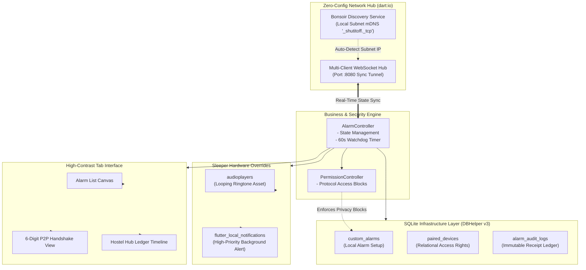

# 🔔 ShutItOff — Remote Control Alarm App for Roommates

📲 **Latest Build v1.0.0 Compiled Successfully.** Download the standalone APK installer directly onto your Android device to skip system clock constraints.

**ShutItOff** is a local peer-to-peer mobile application built with Flutter designed specifically for hostels, dorms, and shared apartments. It solves a highly universal pain point: **turning off a heavy-sleeping roommate's alarm when they refuse to wake up and their phone won't stop ringing.**

Because mobile operating systems strictly block third-party applications from controlling the system's default Clock app, **ShutItOff bypasses these constraints by implementing its own internal custom alarm scheduler background engine.** When an alarm fires, it securely synchronizes state changes across a local network tunnel, allowing authorized roommates to remotely `Snooze` or `Turn Off` the alarm right from their own devices.

---

## 🎨 Visual Identity
The application utilizes a high-contrast **Clockwork Orange-inspired minimalist light theme**. 
* **Canvas Backdrop:** Clean, retro cream-white canvas (`#FAF6EE`).
* **UI Elements:** Flat panels bounded by heavy, solid black geometric outlines.
* **Accent Indicators:** Pulsing **Neon-Cyan** handles display active local Wi-Fi connectivity, while **Deep Alarm-Orange** emphasizes active ringing states.
* **The Icon Layout:** A central mechanical twin-bell alarm clock framing a digital power standby symbol (`⏻`) within a geometric eye iris.

---

## 🚀 Architectural Blueprint

---

## 🛠️ Developmental Milestones (6-Phase Implementation)

The platform was built from the ground up in six distinct standalone development increments:

### Phase 1: Local Clock Core & Native Alarm Engine
* **Engine Core:** Implemented local SQLite tables to manage scheduling matrices entirely inside the application ecosystem.
* **Background Security:** Configured `android_alarm_manager_plus` alongside an isolated background `ReceivePort` communication pipeline. This ensures the audio array loop continues firing at maximum performance even if the smartphone drops into deep Android Doze mode.

### Phase 2: Peer-to-Peer Handshake & Authorization
* **Secure Handshake:** Established a 6-digit deterministic handshake verification protocol to instantly bind separate instances of the app.
* **Privacy Controls:** Deployed a rigid `PermissionController` layer. A host can grant granular rights to `Allow Turn Off` or `Allow Snooze`, but the app permanently blocks incoming remote data packets from altering base alarm times or browsing local storage files.

### Phase 3: Real-Time LAN Connection Sync
* **Zero-Config Discovery:** Leveraged the `bonsoir` mDNS service framework to allow devices to auto-discover local network nodes broadcasting `_shutitoff._tcp` across a shared hostel Wi-Fi router.
* **Internet-Free Tunneling:** Developed a dual-role local WebSocket server/client architecture via `dart:io`. The system manages data exchange pipelines seamlessly without relying on cloud databases or active internet access.

### Phase 4: Chronological Escalation Engine ("Wake Him!")
* **Watchdog Loop:** Integrated a background 1-second interval watchdog sequence into the active alarm handler.
* **Remote Alarm Escalation:** If an alarm triggers and goes unanswered for 60 seconds, the app broadcasts an `ALARM_ESCALATED` payload. This forces the roommate's app to flash a neon-orange banner and unlocks an emergency **[WAKE HIM]** button.
* **Siren Acceleration:** Tapping the override command sends a high-priority packet back to the sleeper's phone, instantly forcing the hardware audio layer to 100% volume and accelerating playback speed to a frantic 1.5x siren loop.

### Phase 5: Shared Group Spaces ("The Hostel Hub") Multi-Node Ledger
* **Hostel Rooms:** Expanded single P2P connection channels into a multi-client array (`List<WebSocket>`) capable of managing a full room cluster (e.g., "Room B204").
* **Immutable Audit Ledger:** Built an `alarm_audit_logs` history grid tracking user interactions with strict cryptographic attribution. To prevent hostel arguments, the app posts a permanent, un-falsifiable receipt specifying exactly who silenced or snoozed whose device.

### Phase 6: Light-Theme Eye-Clock UI & Visual Finish
* **System Integration:** Unified all individual components under a polished tab structure wrapped in the high-contrast Clockwork Orange light theme framework.
* **Dynamic Connection Glow:** Embedded custom visual neon canvas rings that actively switch pulse vectors—neon-cyan to show normal local connection stability, and shifting to alarm-orange when an active ringing event propagates down the socket network stream.

---

## 🛡️ Strict Technical Security Standards
To guarantee user privacy and data security inside a shared dormitory environment, the app strictly implements the following structural rules:
1. **Network Boundary isolation:** Sockets only open local handshake pipelines between pre-approved devices on the same network subnet.
2. **Structural Firewall Checkpoint:** The `PermissionController` actively checks incoming string commands at the socket layer. It completely drops any illegal frames requesting table configurations, system file pathways, or deletion access.
3. **Accountability Tracking:** Room nodes cannot perform silent dismissals. Every action writes a timestamp row directly into the user-facing database logs.
