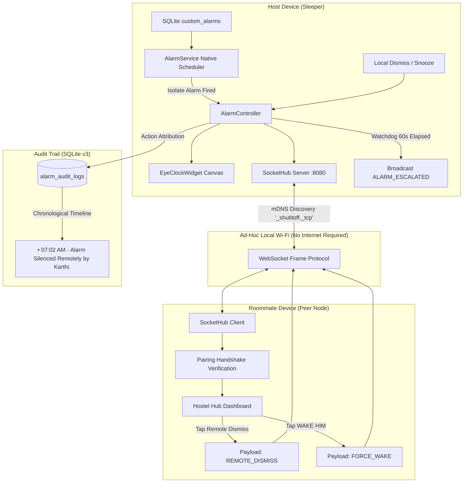

# ⏰ ShutItOff

> **The Aggressive, Peer-Authorized LAN Alarm Engine for Roommates & Hostel Hubs.**

[](https://flutter.dev)
[](https://dart.dev)
[](LICENSE)
[](#test-suite--quality-assurance)
[](#phase-3-real-time-lan-mesh--mdns-discovery)
[](#database-architecture)

---

## 📖 Overview

**ShutItOff** is a distributed, zero-cloud peer-to-peer alarm synchronization system built with Flutter. It is specifically engineered to solve the age-old hostel and roommate dilemma: **someone sleeping through a deafening alarm without waking up**.

Instead of relying on cloud infrastructure, push notifications, or external servers, **ShutItOff** forms an ad-hoc local mesh network over Wi-Fi using zero-configuration mDNS discovery and lightweight background WebSockets. Roommates can authorize each other via 6-digit cryptographic PINs, view who is currently ringing, silence or snooze alarms remotely from their own bed, and escalate to a max-volume panic siren if the sleeper remains unresponsive after 60 seconds.

Every deactivation or snooze interaction is written to an immutable local SQLite ledger with actor attribution (e.g., *"• 07:02 AM - Alarm Silenced Remotely by Karthi."*).

---

## ⚡ Core Architectural Phases

ShutItOff was constructed across 6 rigorous engineering phases:

### 1. Phase 1: Local SQLite Alarm Engine & Background Scheduler
- **Native Alarm Manager**: Tied directly to native Android background alarms (`android_alarm_manager_plus`), ensuring execution even if the device is locked or in Doze mode.
- **Isolate Port Bridge**: An internal `ReceivePort` and `IsolateNameServer` communicate background alarms directly to the foreground controller.
- **Aggressive Heads-Up Overlay**: Full-screen modal overlay presenting only two actions: swipe-to-turn-off `[TURN OFF]` and `[SNOOZE]`.
- **Local Persistence**: SQLite database table `custom_alarms` storing schedules and active states.

### 2. Phase 2: Peer-to-Peer 6-Digit Handshake Engine
- **Cryptographic Handshake**: Generates randomized, format-validated 6-digit connection codes (`r'^\d{6}$'`).
- **Granular Permission Matrix**:
  - `Allow Turn Off`: Permits roommates to silence ringing alarms remotely.
  - `Allow Snooze`: Permits roommates to snooze alarms for 5-minute increments.
- **Security Guardrails**: Hard blocks peers from modifying base scheduled times or inspecting raw database records.
- **Pairing Table**: SQLite table `paired_devices` storing authorized roommate identities and capabilities.

### 3. Phase 3: Real-Time LAN Mesh & mDNS Discovery
- **Zero-Cloud Discovery**: Uses multicast DNS via `bonsoir` advertising `_shutitoff._tcp` on local subnets.
- **Self-Hosting WebSocket Hub**: When an alarm fires, the host phone automatically hosts an IPv4 `HttpServer` / WebSocket server on port `8080`.
- **Strict Protocol Parser**: Ignores arbitrary payloads and acts exclusively upon validated protocol signatures (`ALARM_RINGING`, `REMOTE_DISMISS`, `REMOTE_SNOOZE`, `ALARM_ESCALATED`, `FORCE_WAKE`).

### 4. Phase 4: Chronological Escalation Engine ("Wake Him!")
- **60-Second Watchdog Counter**: A real-time timer starts the exact millisecond an alarm starts ringing.
- **Escalation Broadcast**: If 60 seconds elapse without local or remote dismissal, the host broadcasts `ALARM_ESCALATED`.
- **Override Controller UI**: Roommate dashboards flash an aggressive warning banner: *"🔔 [Friend] has been sleeping through their alarm for 1 minute!"*.
- **The `[WAKE HIM]` Override**: Roommates can tap `[WAKE HIM]` to dispatch `FORCE_WAKE`, triggering a frantic, maximum-volume bypass siren loop on the host device.

### 5. Phase 5: Multi-Node Hostel Hub & Audit Log Ledger
- **Shared Room Nodes**: SQLite table `hostel_rooms` maps room entities (e.g. `🏢 ROOM: B204`) with a 6-digit host code.
- **Multi-Client Concurrent Broadcast**: The socket hub tracks `List<WebSocket> _connectedClients` and broadcasts alarm states to all tethered roommates simultaneously.
- **Action Attribution Ledger**: SQLite table `alarm_audit_logs` records every deactivation with exact timestamps and actor names:
  - `• 07:02 AM - Alarm Silenced Remotely by Karthi.`
  - `• 06:45 AM - Snoozed Remotely by Rahul.`
- **Hostel Hub Dashboard**: Displays the active room badge, tethered peer count, authorized roommate chips, and a scrollable chronological action receipt timeline.

### 6. Phase 6: Light-Theme Eye-Clock UI & Neo-Brutalist Visual Finish
- **Retro Cream Palette**: Canvas background `#FAF6EE` paired with `#FFFFFF` panels, `#000000` solid borders (`Border.all(width: 2.0)`), and crisp drop shadows (`Offset(4, 4)`).
- **Geometric Slab-Serif Typography**: Heavy, stark black slab-serif typography architecture for high-contrast visibility.
- **Eye-Clock Hero Node**: A custom `CustomPainter` canvas widget rendering:
  - Circular clock face with 12 geometric slab hour ticks.
  - An almond-shaped stylized eye silhouette with animated pupil, iris, and live clock hands.
- **Dynamic Glow Indicators**:
  - **Tethered Mode**: Soft, glowing neon-cyan (`#00E5FF`) ambient trail with cyan iris.
  - **Ringing / Escalated Mode**: Heavy pulsing warm-orange neon (`#FFFF5722`) stroke halo driven by an `AnimationController`.
  - **Idle Mode**: High-contrast black slab border on retro cream canvas.
- **3-Tab Master Dashboard**:
  - **Tab 1 (`ALARMS`)**: Eye-Clock glow node, Network Connection HUD, and Custom Alarms list.
  - **Tab 2 (`HANDSHAKE`)**: 6-digit code generator, friend authorization input, and granular permissions.
  - **Tab 3 (`HOSTEL HUB`)**: Shared room badge, tethered roommates, and Action Ledger receipts.

---

## 🏗️ System Architecture



---

## 📡 WebSocket Network Protocol

All real-time communications operate over local WebSockets using strict JSON payloads:

| Event Signature | Origin | Payload Parameters | Purpose |
|:---|:---|:---|:---|
| `ALARM_RINGING` | Host Phone | `alarm_id`, `timestamp` | Broadcasts that an alarm has started ringing. |
| `REMOTE_DISMISS` | Roommate Phone | `alarm_id`, `actor_name`, `timestamp` | Remotely silences the host alarm with user attribution. |
| `REMOTE_SNOOZE` | Roommate Phone | `alarm_id`, `actor_name`, `minutes`, `timestamp` | Remotely snoozes the host alarm for 5 minutes. |
| `ALARM_ESCALATED` | Host Phone | `alarm_id`, `friend_name`, `timestamp` | Fires after 60s of unacknowledged ringing. |
| `FORCE_WAKE` | Roommate Phone | `alarm_id`, `timestamp` | Overrides phone settings to force a frantic 100% volume panic siren. |

---

## 🗄️ Database Architecture

ShutItOff utilizes **SQLite v3** via `sqflite` with automatic schema upgrades:

```sql
-- Phase 1: Local custom alarms table
CREATE TABLE custom_alarms (
  id INTEGER PRIMARY KEY AUTOINCREMENT,
  alarm_time TEXT NOT NULL,
  is_enabled INTEGER NOT NULL
);

-- Phase 2: Roommate pairing permissions table
CREATE TABLE paired_devices (
  id INTEGER PRIMARY KEY AUTOINCREMENT,
  friend_name TEXT NOT NULL,
  connection_code TEXT NOT NULL,
  is_authorized INTEGER NOT NULL,
  can_snooze INTEGER NOT NULL,
  can_turn_off INTEGER NOT NULL
);

-- Phase 5: Shared hostel rooms table
CREATE TABLE hostel_rooms (
  id INTEGER PRIMARY KEY AUTOINCREMENT,
  room_name TEXT NOT NULL,
  host_code TEXT NOT NULL
);

-- Phase 5: Action attribution audit ledger table
CREATE TABLE alarm_audit_logs (
  id INTEGER PRIMARY KEY AUTOINCREMENT,
  alarm_id INTEGER,
  actor_name TEXT NOT NULL,
  action_type TEXT NOT NULL,
  timestamp TEXT NOT NULL
);
```

---

## 🎨 Design System: Retro Cream & Geometric Slab

ShutItOff follows a bold, neo-brutalist light theme defined in [`lib/theme/app_theme.dart`](lib/theme/app_theme.dart):

- **Canvas Background**: `#FAF6EE` (Retro Soft Cream)
- **Panel Surface**: `#FFFFFF` (Card White) / `#F2ECE1` (Muted Cream)
- **Stark Outlines**: Solid `#000000` (2.0px & 3.0px borders)
- **Neo-Brutalist Shadows**: `BoxShadow(color: Colors.black, offset: Offset(4, 4), blurRadius: 0)`
- **Accent Signals**:
  - `Neon-Cyan (#00E5FF)`: Active tethered mesh streams
  - `Alarm-Orange (#FFFF5722)`: Firing alarms and emergency actions
  - `Warning-Amber (#FF9500)`: Scanning subnet state
  - `Success-Green (#00C853)`: Successful authorization and active node states

---

## 📂 Project Structure

```
lib/
├── controllers/
│   ├── alarm_controller.dart        # Core alarm lifecycle, watchdog & audit dispatcher
│   └── permission_controller.dart   # Handshake validator & granular permissions
├── data/
│   └── db_helper.dart               # SQLite database helper (Version 3)
├── models/
│   └── pairing_handshake.dart       # Handshake generator & pairing session entity
├── screens/
│   ├── escalation_overlay.dart      # Chronological escalation [WAKE HIM] UI
│   ├── eye_clock_widget.dart        # Eye-Clock Canvas Painter & dynamic glow halos
│   ├── hostel_hub_screen.dart       # Shared Room Node & Action Ledger receipt list
│   ├── network_hud_widget.dart      # Real-time connection health & subnet radar
│   └── pairing_screen.dart          # 6-digit handshake exchange & permission toggles
├── services/
│   ├── alarm_service.dart           # Native Android alarms, notifications & ringtones
│   ├── network_discovery.dart       # mDNS LAN browsing & advertising via Bonsoir
│   └── socket_hub.dart              # Multi-client WebSocket server & client broadcaster
├── theme/
│   └── app_theme.dart               # Retro cream, stark black & geometric slab typography
└── main.dart                        # Master dashboard linking View Panels A, B, and C
```

---

## 🧪 Test Suite & Quality Assurance

The codebase includes comprehensive unit, widget, and protocol integration test suites:

```bash
flutter test
```

### Test Coverage Highlights (37 Tests Total)
- **`test/alarm_controller_test.dart`**: Validates alarm state transitions, scheduling, and local turn-off/snooze.
- **`test/pairing_handshake_test.dart`**: Tests 6-digit regex code generation, mathematical verification, serialization, and permission revocation.
- **`test/network_sync_test.dart`**: Tests real-time LAN socket handshake, protocol enforcement, and network HUD widget states.
- **`test/escalation_engine_test.dart`**: Tests 60-second watchdog stopwatch, `ALARM_ESCALATED` socket dispatch, and `EscalationOverlay` rendering.
- **`test/multi_client_ledger_test.dart`**: Tests multi-client connection array management, concurrent broadcasts, attributed JSON transmissions, and `HostelHubScreen` widget rendering.
- **`test/light_theme_eye_clock_test.dart`**: Tests `AppTheme` design tokens, `EyeClockWidget` glow halo morphing, and end-to-end 3-tab navigation.
- **`test/widget_test.dart`**: Verifies root application boot and initial UI tree stability.

---

## 🚀 Getting Started

### Prerequisites
- [Flutter SDK](https://flutter.dev/docs/get-started/install) (`>= 3.3.0`)
- Android Studio or VS Code with Flutter & Dart extensions
- A physical Android device or emulator running on a shared local Wi-Fi network

### Installation & Run

1. **Clone the repository:**
   ```bash
   git clone https://github.com/karthi-2006-11/ShutItOff.git
   cd ShutItOff
   ```

2. **Install dependencies:**
   ```bash
   flutter pub get
   ```

3. **Verify static analysis:**
   ```bash
   flutter analyze
   ```

4. **Execute all test suites:**
   ```bash
   flutter test
   ```

5. **Run on connected device:**
   ```bash
   flutter run
   ```

---

## 📄 License

This project is licensed under the MIT License — see the [LICENSE](LICENSE) file for details.
